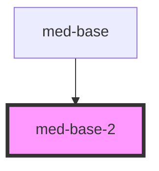

# med-base

<!-- Auto Generated Below -->

## Properties

| Property | Attribute | Description                  | Type                                                                    | Default     |
| -------- | --------- | ---------------------------- | ----------------------------------------------------------------------- | ----------- |
| `color`  | `color`   | Defines the component color. | `ColorsProduct01 \| ColorsProduct02 \| ColorsNeutral \| ColorsFeedback` | `undefined` |

## Dependencies

### Used by

 - [med-base](../med-base)

### Graph

----------------------------------------------

*Built with [StencilJS](https://stenciljs.com/)*
